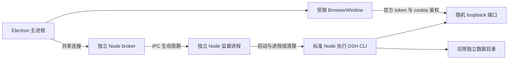

# Agent Note: Electron 桌面化方案与参考项目评审

Status: implemented

## Problem

Nook 的桌面交付需要双击启动、独立窗口、持久化数据、确定的运行时和可靠的退出行为。浏览器启动命令仍要求开发环境；把网址放进窗口不足以解决依赖、鉴权、升级保留数据和安装包验收。

参考项目为本机 `/Users/yifan/workspace/indie/research-all-in-one-dsh`，核对基线为提交 `04c35a03578689cd89069283aee38912cfd86cef`，其桌面代码使用 Electron `44.0.0` 和 DSH `0.1.1-rc.2`。Nook 的 DSH 启动接入基线归属[发现记录](../../../../docs/discovery.md)。

## Decision

[桌面应用](../../../../apps/desktop/README.md)使用受限 Electron 窗口加载现有 Nook Web UI，通过独立标准 Node 执行 DSH manifest 声明的 CLI。桌面层拥有窗口、运行时安装、日志和进程监督，业务能力继续遵循[现有架构](../../../../docs/architecture.md)。

### 版本与边界

2026-09-08 查询 npm `electron@latest` 得到 `44.2.0`，与 [Electron 稳定版列表](https://releases.electronjs.org/?channel=stable)一致。应用 manifest 和 lockfile 固定这个版本，启动时不在线解析版本。[标准 Node 下载脚本](../../../../scripts/desktop/desktop-node.mjs)固定 `24.20.0` 和官方归档 SHA-256。

选择标准 Node 是为了让 DSH 的原生依赖和子进程使用同一 ABI，避免 Electron 更新要求重建整套 DSH 依赖。electron-builder 负责外壳，Nook stage 负责独立运行时，禁用对该运行时的 Electron ABI 重建。首个交付范围是本地未签名 macOS arm64 `.app`；最低 macOS 版本依据 [Electron 44 发布说明](https://releases.electronjs.org/release/v44.0.0)。

### 参考项目中值得复用的部分

| 部分                                          | 价值                         | Nook 接入方式                                    |
| --------------------------------------------- | ---------------------------- | ------------------------------------------------ |
| 窗口与 DSH 进程分离                           | 不侵入 DSH UI 和业务插件     | 保留分层，替换运行时启动方式                     |
| `127.0.0.1` 与端口 `0`                        | 由 DSH 原子绑定可用端口      | 使用已核实 CLI 参数，禁止抢占其他进程端口        |
| 明确关闭 Node integration、开启隔离与 sandbox | Renderer 不获得系统执行能力  | 保留默认策略，以真实业务流程验证权限需求         |
| 启动页、异常退出后撤销 origin                 | 将启动失败和后端崩溃显式呈现 | 补充重试、加载失败和退出竞态处理                 |
| 独立 userData、拒绝真实 DSH home              | 桌面数据与开发环境分离       | 桌面开发使用临时 home，用户模式使用应用专属 home |
| 离线 Profile seed、临时 staging、指纹         | 首启无需 pnpm 和网络安装     | 使用 Nook 自己的打包流水线生成 seed              |
| 单实例、函数化路径与 URL 策略                 | 容易独立验证                 | 保留设计并补足 Electron 窗口级验收               |

参考代码可以作为结构模板；不能整目录复制后仅改包名。尤其不能携带其 DSH 版本、旧启动协议或手写的产品包清单。

### 确定的迁移阻断与优化点

下表的源码位置均相对于参考项目根目录，行号对应上述核对基线。实验只使用合成 token、内存数据库和可丢弃的临时数据。

| 优先级   | 证据位置与结果                                                                                                                                                                       | 对 Nook 的影响及处理                                                                                                            |
| -------- | ------------------------------------------------------------------------------------------------------------------------------------------------------------------------------------ | ------------------------------------------------------------------------------------------------------------------------------- |
| 接入前   | `apps/desktop/src/runtime-entry.ts:24` 动态导入 DSH 入口。本次对新版入口做同样导入，只得到 `runCli` 导出，不执行 CLI；直接执行 `--version` 则输出版本                                | 旧启动路径失效。通过独立 Node 执行 manifest 声明的 bin，避免依赖内部启动实现                                                    |
| 接入前   | `apps/desktop/src/runtime.ts:62` 只接受没有路径和 query 的 URL。本次输入合成的当前鉴权 URL，返回 `undefined`                                                                         | 即使后端启动也会等到超时。支持当前 URL 格式，完整 token URL 只在内存中用于首次鉴权                                              |
| 接入前   | `apps/desktop/electron-builder.yml` 设置 `npmRebuild: false`，seed 来自标准 Node 安装。实测 Nook 的 `fs-ext` 在 Node 下加载成功，在参考 Electron 的 Node 模式下报 ABI 137/149 不匹配 | 不能把标准 Node 原生产物直接交给 Electron。推荐将它们与标准 Node 一起交付；采用 UtilityProcess 时必须另建 Electron 专用依赖产物 |
| 接入前   | `apps/desktop/src/main.ts:104` 将原始 stdout/stderr 同时写磁盘和终端，`:262` 打印 ready URL                                                                                          | 迁入新版鉴权后会写出 token。解析与日志输出分开；跨 chunk 脱敏、限制单行和缓冲区大小、日志轮转，错误页和诊断导出同样脱敏         |
| 数据保护 | `apps/desktop/src/profile.ts:69` 替换整个 Profile，`:94` 随后删除旧目录。本次 v1→v2 合成升级把用户 `cordis.patch.yml` 恢复成 seed 的 `[]`                                            | 保留用户 Profile patch 和插件配置；对用户状态先做可验证、可恢复的备份，再进行迁移。目录 rename 不能替代备份和迁移验收           |
| 生命周期 | `apps/desktop/src/main.ts:198` 在停止开始就清空全局 runtime，`:285` 在 runtime 不存在时放行退出                                                                                      | 连续退出请求可能跳过尚未完成的清理。用共享 `shutdownPromise`、启动取消信号和完整状态机实现幂等停止                              |
| 生命周期 | 同文件只监督 UtilityProcess 的 PID；强杀后没有再次等待退出。外层异常处理和 `loadURL` 失败也没有统一进入停止路径                                                                      | 明确拥有整个进程树，所有失败进入同一清理路径；断言终止后端口和子进程均消失。是否存在实际残留尚未实测                            |
| 验收     | `apps/desktop/src/main.ts:231` 在 smoke 模式跳过创建 BrowserWindow；`scripts/verify-desktop-app.mjs:82` 仍使用该模式验收打包应用                                                     | 现有 smoke 只能证明 Electron 启动了后端，不能证明页面、cookie、RPC 或原生交互正常。增加真实打包窗口验收                         |
| 构建维护 | `scripts/stage-desktop-profile.mjs` 复制临时源码镜像、另列包与行清单，再重写已部署包的 manifest                                                                                      | 优先复用 Nook 的 pack 流水线；通过 pnpm pack 正规展开 workspace 依赖。构建生成独立 manifest，不修改安装后的任何包               |

ABI 实验使用参考 Electron `44.0.0` 的 `ELECTRON_RUN_AS_NODE` 模式，并未声称已验证 `44.2.0` 的 UtilityProcess 全链路。两种运行时下 `node:sqlite` 的内存 FTS5 实验都成功；它是验收项，不是已发现的故障。

### 安装与用户数据

[stage](../../../../scripts/desktop/stage-desktop.mjs)复用现有 tarball 安装流水线，生成可搬移的依赖闭包；不维护第二套产品包或 Bundle 清单，不修改安装后的第三方包。Electron 主进程进入 ASAR，Node、DSH 和原生文件使用 extraResources。

运行时按内容指纹安装到独立版本目录，校验覆盖文件、链接和可执行位。写入临时目录后再次校验，再以同文件系统 rename 发布；旧版本保留。可写 Profile 使用逐包链接连接应用运行时，因此 DSH 的 fallback 链接修复不会修改完整性清单覆盖的内容。用户 manifest、patch、会话、凭据与业务数据保持在版本目录之外；网页数据合并由[共享运行环境决策](2026-09-08-shared-runtime.md)定义，旧数据不删除。

打包器会省略空目录。空的 seed `home/agents` 因而不进入清单，由可写 home 创建；[打包门禁](../../../../scripts/desktop/package-desktop.mjs)核对 electron-builder 实际产物，防止只验证打包前目录而遗漏分发变化。

监督进程取得 Nook 数据锁后调用[备份机制](../../../../docs/backup.md)，备份成功才启动 DSH。该快照仅覆盖其声明的 Nook 业务数据，不冒充完整 Harness home 备份。SQLite 只读打开干净 WAL 数据库也会创建空 WAL，备份比较仅忽略自身新建的零字节 WAL 与 SHM；已有或非空 WAL 仍须完整校验，见[备份决策](../feature/2026-09-08-data-backup.md)。

### 启动与退出

CLI 输出解析与日志分离，完整 token URL 只交给受限窗口完成官方 cookie 交换；磁盘日志按完整行脱敏并限制缓冲区及单次日志大小。导航限制在当前实例 origin，权限 request/check 均拒绝，没有通用 preload。相关边界依据 [Electron 安全指南](https://www.electronjs.org/docs/latest/tutorial/security)。

主进程退出等待共享的停止 promise，启动过程接受取消信号。独立监督进程观察 broker IPC 断开并回收其拥有的 DSH 进程组；前端连接的生命周期见[共享运行环境决策](2026-09-08-shared-runtime.md)。先发送 TERM，超时后 KILL，并等待退出；不承诺跨越第三方自行脱离进程组后的完整 OS 级进程容器。错误处理共用一次清理，防止启动拒绝与异步退出同时加载错误页。

## Alternatives considered

**直接复制参考项目。** 它的旧启动协议、鉴权解析、ABI 和 Profile 覆盖行为与当前 Nook 冲突，采用其分层思路并重做这些边界。

**UtilityProcess 或 Electron 主进程承载 DSH。** 前者需要单独重建并验证 Electron ABI 的依赖闭包，后者还把 Cordis 和同步数据库耦合到窗口管理。标准 Node 将 Electron 升级与这些依赖解耦。

**依赖用户系统 Node 或只连接已运行的 Web。** 无法满足独立安装与双击启动的交付要求。

**自定义协议、preload 代理全部 RPC 或重写 Renderer。** 需要重建模块加载、WebSocket、cookie 和资源路由的契约，现有 Web Host 已能承载窗口，因此不选。

**直接从只读资源启动整个 Profile。** 与 CLI 配置写入和 fallback 行为冲突。只把整个 node_modules 链接到可写 Profile 也会让 fallback 写入污染 seed；逐包链接使可写组合与不可变依赖分离。

## Consequences

构建、类型、契约、集成、边界、peer、独立 tarball 安装和 Web 开发模式验证覆盖共用流水线。[真实打包窗口门禁](../../../../scripts/verify/verify-desktop.mjs)搬移 `.app` 到包含中文与空格的目录，使用不含开发工具的 PATH，覆盖 cookie、RPC、笔记持久化、备份、第二次启动、资源损坏后重试和退出清理。[生命周期测试](../../../../tests/integration/desktop-runtime.test.ts)覆盖重复停止和父进程崩溃，[安装测试](../../../../tests/desktop/payload.test.ts)覆盖数据和 patch 保留、损坏与越界链接。

本机两轮打包窗口验收测得首次启动约 31–41 秒、再次启动约 9 秒；这包含安装或完整性校验，是单机观测，不是跨设备性能承诺。独立 Node 与版本目录保留增加磁盘占用，完整校验增加冷启动 I/O；不以跳过校验或自动删除用户数据换取速度。缓存优化、增量安装和历史版本清理需要各自的恢复与中断验收。

其他操作系统、签名、公证、自动更新、跨版本数据库降级、磁盘不足与真实断电恢复尚未通过发布验证。浏览器和视频工具仍遵循各自外部依赖，不因 Electron 自带 Chromium 而宣称可离线使用全部扩展功能。首版不等同于面向所有平台的正式发行。
